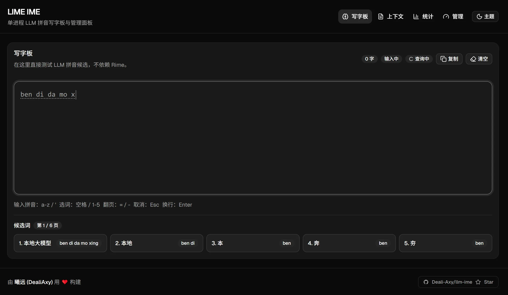

# llm-ime

基于本地 GGUF 大语言模型的中文拼音输入法引擎，提供 Web Dashboard 用于打字练习、输入统计和引擎管理。



## 项目背景

> ⚠️ **实验性项目**：目前仍以 Web 验证为主，但已经提供了一个面向 **Windows 小狼毫（Weasel）** 的实验性 RIME 前端配置目录，用于验证真实输入法场景下的候选同步、上下文管理和会话隔离。

本项目受到 [lime](https://github.com/xushengfeng/lime) 的启发，探索一种新的输入法思路：**利用本地大语言模型的语言理解能力来驱动候选词排序**，而非依赖传统的 N-gram 统计词库。

### 核心思路

传统输入法的候选词来自预先统计的词频库，缺乏真正的语境理解。LLM 则天生具备这种能力——它在预测下一个词时，会综合考虑前文语境、语义连贯性和常用表达习惯。

llm-ime 把这两者结合：用户输入拼音，引擎以此为约束，让 LLM 在符合拼音的候选词中按当前语境打分排序，再呈现给用户选择。结果是，即使只用一个 ~350 MB 的量化小模型（Qwen3-0.6B-IQ4_XS），候选词的上下文相关性也能明显优于纯词频方案，且完全本地运行，无隐私风险。

### 当前阶段

目前以 **Web Dashboard** 作为主要验证载体：在浏览器里打字，实时看到候选词、输入统计和引擎状态，用于验证引擎逻辑的正确性和响应速度。除此之外，仓库中也提供了一个 **Windows 小狼毫实验性 RIME 前端**，用于验证真实输入法前端接入。后续仍可能继续沿 RIME 深化，或进一步探索独立原生前端。

## 项目结构

pnpm monorepo，包含三个工作区：

```
llm-ime/
├── apps/
│   ├── server/   LLM 引擎 + Hono HTTP API + 静态文件托管（Node.js + tsx）
│   └── web/      Dashboard 前端（React + Vite + TanStack Router）
├── rime/         Windows 小狼毫可直接复制的实验性 RIME 配置目录
├── scripts/      模型下载、RIME 安装等辅助脚本
└── packages/
    └── ui/       共享 shadcn/ui 组件库
```

## 技术栈

| 层 | 技术 |
|---|---|
| 运行时 | Node.js ≥ 20，tsx（TypeScript 直接执行） |
| HTTP 框架 | Hono + @hono/node-server |
| LLM 推理 | node-llama-cpp（本地 GGUF 模型） |
| 前端框架 | React 19 + Vite |
| 路由 | TanStack Router |
| UI | Tailwind CSS v4 + shadcn/ui |
| 主题 | next-themes（dark / light 切换） |
| API 调用 | Hono RPC（`hc<AppType>()`，端到端类型推导） |

## 架构设计

### 单进程服务

LLM 推理引擎与 HTTP 服务在同一个 Node.js 进程中运行，无需分离守护进程或 IPC 通信。

### Hono RPC 类型共享

`apps/server/api-type.ts` 定义了虚拟路由（仅用于类型推导，从不执行），导出 `AppType`。前端通过 pnpm workspace 引用 `@workspace/server/api-type`，用 `hc<AppType>("/")` 创建类型化客户端，请求/响应类型由服务端路由自动推导，无需手写类型定义。

### 异步候选词（防卡顿）

按键时立即更新输入显示（同步），候选词请求经 150ms 防抖后异步发出。快速连击时只触发最后一次请求，旧响应被丢弃，打字过程完全不阻塞。

### 模糊拼音

内置声母/韵母模糊匹配（z↔zh、c↔ch、s↔sh、an↔ang、en↔eng 等），提高容错性。

## 前端页面

| 路由 | 页面 | 说明 |
|------|------|------|
| `/` | 写字板 | 打字练习，实时候选词，选词提交 |
| `/statistics` | 统计 | 输入速度、按键间隔等输入统计数据 |
| `/context` | 上下文 | 当前模型上下文 Token 和用户词列表 |
| `/admin` | 管理 | 引擎状态（就绪时间、词条数、上下文量等） |

## API 端点

服务默认监听 `http://127.0.0.1:5000`（可通过 `PORT` / `LLM_IME_PORT` 和 `HOST` / `LLM_IME_HOST` 修改）。

| 方法 | 路径 | 说明 |
|------|------|------|
| `GET` | `/api/status` | 引擎状态（就绪时间、词条数等） |
| `POST` | `/api/candidates` | 获取拼音候选词（`{ keys: string }`） |
| `POST` | `/api/commit` | 提交选词（`{ text, new?, update? }`） |
| `GET` | `/api/userdata` | 用户词与当前上下文 Token |
| `GET` | `/api/inputlog` | 输入统计快照 |
| `POST` | `/api/learntext` | 从文本中学习新词（`{ text: string }`） |
| `POST` | `/api/ime/session` | 创建 / 续用输入法会话（`{ sessionId? }`） |
| `POST` | `/api/ime/candidates` | 按会话获取候选词（`{ sessionId, keys }`） |
| `POST` | `/api/ime/commit` | 按会话提交文本（`{ sessionId, text, new?, update? }`） |
| `POST` | `/api/ime/reset` | 重置输入法会话上下文（`{ sessionId }`） |
| `GET` | `/api/ime/health` | IME 会话管理健康状态 |

## 快速开始

### 前置条件

- Node.js ≥ 20
- pnpm ≥ 9
- 一个 GGUF 格式的语言模型文件（默认使用 Qwen3-0.6B-IQ4_XS）

### 安装依赖

在 `llm-ime/` 根目录运行：

```bash
pnpm install
```

### 下载模型

建议将模型仓库放在与本项目同级的目录下：

```
<父目录>/
├── llm-ime/               ← 本仓库
└── Qwen3-0.6B-GGUF/
    └── Qwen3-0.6B-IQ4_XS.gguf
```

推荐直接运行仓库内置脚本，只下载本项目需要的单个模型文件（约 350 MB）：

```bash
pnpm run model:download
```

该命令会直接从 ModelScope 仓库 `https://www.modelscope.cn/unsloth/Qwen3-0.6B-GGUF.git` 下载 `Qwen3-0.6B-IQ4_XS.gguf`，并保存到与本仓库同级的 `Qwen3-0.6B-GGUF/` 目录中，不会下载完整的 20+ GB 模型仓库。

如需自定义保存路径：

```bash
pnpm run model:download -- /path/to/Qwen3-0.6B-IQ4_XS.gguf
```

如不想使用脚本，也可以直接下载单文件：

```bash
curl -L "https://www.modelscope.cn/api/v1/models/unsloth/Qwen3-0.6B-GGUF/repo?Revision=master&FilePath=Qwen3-0.6B-IQ4_XS.gguf" -o Qwen3-0.6B-IQ4_XS.gguf
```

### 配置模型路径

默认从与本仓库同级的 `Qwen3-0.6B-GGUF/` 目录中加载模型，如需使用其他路径，在仓库根目录创建 `.env` 文件（复制 `.env.example` 修改即可）：

```bash
cp .env.example .env
```

`.env` 示例内容：

```env
LLM_IME_MODEL_PATH=D:\models\Qwen3-0.6B-IQ4_XS.gguf
LLM_IME_SHARED_SECRET=change-me
```

`.env` 文件已加入 `.gitignore`，不会被提交。也可以直接设置系统环境变量（优先级高于 `.env`）：

```bash
# Windows
set LLM_IME_MODEL_PATH=D:\models\your-model.gguf

# macOS / Linux
export LLM_IME_MODEL_PATH=/path/to/your-model.gguf
```

### 接入 RIME 前端（Windows 小狼毫）

仓库根目录提供了一个可直接复制的 `rime\` 目录，首版目标是 **Windows 小狼毫（Weasel）**。

1. 启动后端服务

```bash
pnpm run server
```

2. 如需启用本地鉴权，在 `.env` 中设置 `LLM_IME_SHARED_SECRET`，然后同步修改 `rime\lua\llm_ime_config.lua` 中的 `shared_secret`

   `rime\lua\llm_ime_config.lua` 里还提供了 `connect_timeout_seconds` 和 `request_timeout_seconds`。默认采用较短超时，目的是在服务异常或模型响应过慢时尽快失败，避免把小狼毫长时间卡住。

3. 安装 RIME 配置（二选一）

```bash
# 方式 A：自动安装到 %APPDATA%\Rime，并先备份现有配置
pnpm run rime:install
```

或手动把 `rime\` 目录中的文件复制到你的 `%APPDATA%\Rime` 目录。

4. 在小狼毫中执行“重新部署”或重启输入法

5. 在方案列表中启用并切换到 **LLM 输入法**

> 默认会把 `llm_ime` 方案追加到 `default.custom.yaml` 的 `schema_list` 中，不会要求你整目录替换现有 RIME 配置。

## 开发模式

在两个终端中分别运行：

```bash
# 终端 1：后端（tsx --watch 自动重载）
pnpm run server:dev

# 终端 2：前端（Vite dev server）
pnpm run web:dev
```

| 地址 | 说明 |
|------|------|
| `http://127.0.0.1:5173` | Vite 开发前端（`/api` 自动代理到 `:5000`） |
| `http://127.0.0.1:5000` | 后端 API |

## 生产部署

```bash
# 1. 构建前端
pnpm run web:build

# 2. 启动服务（同时托管前端静态文件）
pnpm run server
```

服务启动后，`http://127.0.0.1:5000` 同时提供 API 和前端页面。

## 配置参考

支持通过仓库根目录的 `.env` 文件或系统环境变量进行配置（系统环境变量优先级更高）：

| 变量 | 默认值 | 说明 |
|------|--------|------|
| `LLM_IME_MODEL_PATH` | 见上方默认路径 | GGUF 模型文件的绝对路径 |
| `PORT` / `LLM_IME_PORT` | `5000` | 服务监听端口 |
| `HOST` / `LLM_IME_HOST` | `127.0.0.1` | 服务监听地址，RIME 首版建议保持本机回环地址 |
| `LLM_IME_SHARED_SECRET` | 空 | `/api/ime/*` 的可选 Bearer 密钥 |
| `LLM_IME_SESSION_TTL_MS` | `900000` | IME 会话闲置过期时间（毫秒） |

## 开发说明

### TypeScript 检查

```bash
# 检查后端
cd apps/server && ./node_modules/.bin/tsc --noEmit

# 构建前端（含类型检查）
pnpm run web:build
```

### 添加新的 API 端点

1. 在 `apps/server/runtime/types.ts` 中添加响应类型
2. 在 `apps/server/api-type.ts` 中添加虚拟路由（用于 RPC 类型推导）
3. 在 `apps/server/main.ts` 中添加真实路由实现
4. 前端 `apps/web/src/lib/api.ts` 中类型自动同步，只需添加调用方法

## 贡献 & 交流

欢迎一起改进这个项目！

### 🐛 报告问题

使用中遇到 Bug 或有功能建议？请[提交 Issue](https://github.com/Deali-Axy/llm-ime/issues/new)，描述清楚复现步骤和环境信息，我会尽快跟进。

### 🔧 提交代码

1. Fork 本仓库
2. 创建你的功能分支：`git checkout -b feat/your-feature`
3. 提交改动：`git commit -m 'feat: add some feature'`
4. 推送分支：`git push origin feat/your-feature`
5. 发起 Pull Request，描述你做了什么以及为什么

> 提交前请确保 `pnpm run web:build` 和 `tsc --noEmit` 通过。

### 💬 交流讨论

有想法、问题或者只是想聊聊？欢迎通过以下方式联系：

- **GitHub Discussions**：[发起讨论](https://github.com/Deali-Axy/llm-ime/discussions)
- **GitHub**：[@Deali-Axy](https://github.com/Deali-Axy)

### ⭐ 支持项目

如果这个项目对你有帮助，欢迎点个 Star，这是对我最大的鼓励 🙏

---

由 **[曦远 (DealiAxy)](https://github.com/Deali-Axy)** 用 ❤️ 构建

